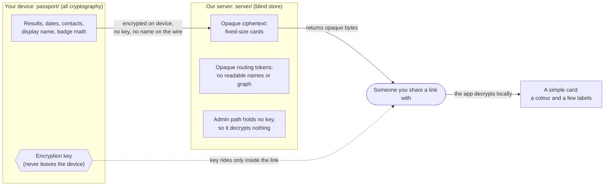

# sti.care

[](https://app.netlify.com/projects/sticare/deploys)
[](https://labs.sti.care/)

A privacy-first, blind-store sexual-health passport. You record your own status
on your phone, it is encrypted there before it ever leaves the device, and you
share it as a link that shows a simple card. The server only ever holds opaque
ciphertext and opaque routing tokens: it can decrypt nothing, and even the admin
secret unlocks no user content.

The guarantees this makes to a user, each tied to a test that runs on every
build, are on the in-app **/promises** page (source: `passport/src/promises/`).

## How it works

Everything sensitive (results, dates, the contact graph, badge math, the
display name) and all cryptography live on the device. Only opaque ciphertext
and opaque routing tokens cross the wire; the key never does. The server is a
blind store: it can decrypt nothing, and the admin path holds no key material,
so even an admin sign-in reads no user content. A `/promises`-page version of
this diagram, written for a non-technical reader, lives in
`passport/src/ui/promises/`.



## Layout

This is a monorepo with two deployables and the docs that govern them.

```
passport/      Vite + React + TypeScript frontend: the app, Storybook, tests.
                 All cryptography happens here; the server never sees plaintext.
server/        Go + embedded SQLite "blind store" API. Stores and serves opaque
                 bytes, runs no health or badge logic, audits admin actions.
labs/docs/     Numbered design docs (NNN-*.md), including the privacy principles
                 and the voice-and-tone guide. Published at labs.sti.care.
deploy/        Site assembly (build-site.sh), the promises/behaviour report
                 builders, and provisioning helpers.
server/deploy/ systemd unit, provision.sh, and the Caddy config for the VPS.
test/          Root-level Node tests for the docs render layer.
```

The blind-store boundary is the core principle and is documented in
[labs/docs/03-design.md](labs/docs/03-design.md); the per-doc index lives in
[CLAUDE.md](CLAUDE.md).

## Development

The two halves are built and tested independently.

```sh
# Frontend (run inside passport/)
npm --prefix passport run dev               # local dev server
npm --prefix passport test                  # unit + integration (Vitest)
npm --prefix passport run typecheck         # tsc, strict
npm --prefix passport run lint              # ESLint
npm --prefix passport run build             # production build
npm --prefix passport run build-storybook   # Storybook for Chromatic

# Backend (run inside server/)
go build ./... && go test ./... && go vet ./...

# Repo root
npx prettier --check .             # formatting gate (separate from ESLint)
```

`labs.sti.care` (the design-docs site) is built from `labs/` and is independent
of the app.

## Deploying

- **Frontend:** Netlify autodeploys every push to `main`. `netlify.toml` runs
  `deploy/build-site.sh`, which assembles `dist/` with the passport app at the
  root, the promises report at `/promises`, and Storybook at `/design`.
- **Backend:** `.github/workflows/deploy.yml` ships the Go binary to the Hetzner
  VPS, where it runs under the hardened systemd unit behind Caddy.

CI (`.github/workflows/ci.yml`) runs the frontend and backend gates plus the
promises check on every pull request; visual baselines are handled by
`.github/workflows/visual.yml` and regenerate via the `screenshot:update` label.
</content>
</invoke>
